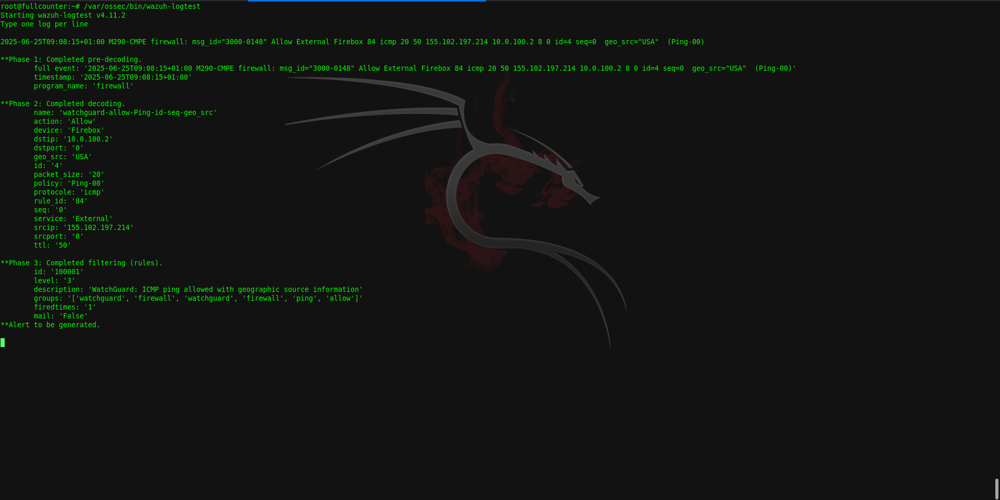
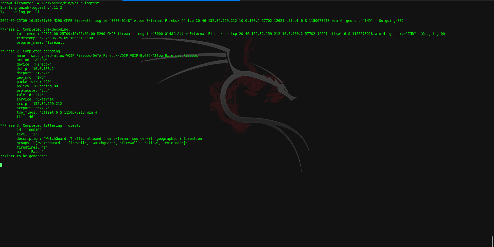

# Wazuh Implementation — Internship Cybersecurity Project

Implementation of a centralized SIEM using **Wazuh** to simulate a real-world log monitoring environment.

---

## 👤 About Me

I’m **0xRayane**, and this project was developed during a **1-month internship** at **CMPE Maroc**. The goal was to deepen my cybersecurity skills by simulating a centralized SIEM deployment using isolated infrastructure on my own machine.

---

## 💡 Project Motivation

This project reflects my transition from systems and networking into cybersecurity. I wanted **hands-on experience** with SIEMs, log parsing, and security automation — so I designed this internship myself with guidance from my supervisor.

After evaluating different options, I chose **Wazuh** for its open-source ecosystem, flexibility, and learning value. I focused on integrating **WatchGuard firewall logs** and building a custom decoder/rule set from scratch.

---

## 🧩 Project Overview

I deployed the Wazuh stack (Manager, Indexer, Dashboard) on **Ubuntu 24.04.2 LTS** and configured it as a **Syslog server** to receive logs from a WatchGuard firewall on **port 514/UDP**. The logs were saved to `/var/log/watchguard.log`.

I then developed:
- A **custom decoder** to extract meaningful fields from WatchGuard logs
- A set of **alert rules** based on decoded data
- Regex patterns to match `msg_id="3000-0148"` log entries
- Manual testing using `wazuh-logtest`

---

## 📁 Project Structure

Wazuh-Implementation/
├── Config-files/
│ └── ossec-ex.conf
├── Decoders/
│ └── 3000-0148.xml
├── Rules/
│ └── 3000-0148-rules.xml
├── Logs/
│ └── logs-example
├── Screenshots/
│ ├── Successful_Data_Extraction1.png
│ └── Successful_Data_Extraction2.png
└── README.md
---

## 🛠️ Tools & Technologies

- **Wazuh** – SIEM platform (Manager, Indexer, Dashboard)
- **WatchGuard Firewall Logs** – Ingested via Syslog
- **Syslog (UDP 514)** – Transport
- **Regex** – Used in decoder pattern matching
- **Linux** – Ubuntu 24.04.2 LTS, `rsyslog`, `journalctl`, `netstat`, etc.
- **Shell/Bash** – Troubleshooting, log handling

---

## ⚙️ Highlights

- Built and tested a **custom decoder** for WatchGuard logs with `msg_id="3000-0148"`
- Regex matched fields like:
  - `srcip`, `dstip`
  - `srcport`, `dstport`
  - `protocol`, `service`, `ruleid`, `action`
- Developed **alert rules** to trigger events based on extracted fields
- Visual confirmation using `wazuh-logtest` (screenshots provided)

---

## 📸 Screenshots

| Screenshot | Description |
|------------|-------------|
|  | Log test matches custom decoder |
|  | All fields extracted correctly |

---

## 🧠 Skills Gained

- Configuring and debugging **Wazuh SIEM**
- Writing **regex-based XML decoders** and rules
- Working with real-world unstructured logs
- Handling installation issues, IP reassignments, broken configs
- Technical persistence under pressure
- Independence and ownership of a complex technical project

---

## 🔧 Future Improvements

- Automate decoder deployment and testing
- Add dashboards for visual alert monitoring
- Explore **log enrichment** with tools like Filebeat or Logstash
- Build Red Team detection scenarios on top of the current setup

---

## 🙌 Thanks

Special thanks to **CMPE Maroc** for the support and resources.  
This project marked my first cybersecurity deep-dive — and it solidified my commitment to becoming a skilled offensive security expert.

> **_ 0xRayane _**
